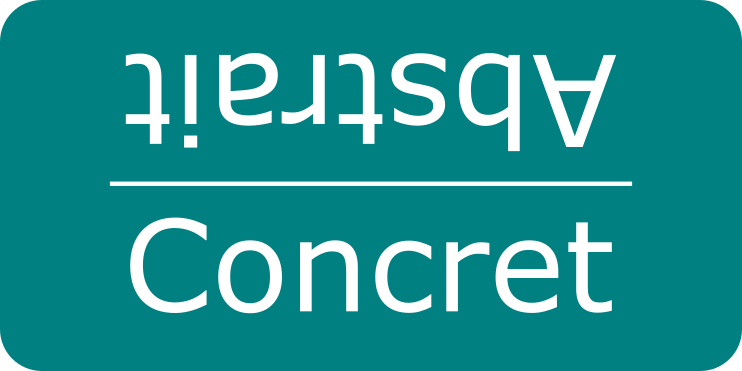

## Online rating study _(onx_absconc)_
### 
Online questionnaire to judge the concreteness or abstraction of words. 
The experiment was built using the [jsPsych library](https://www.jspsych.org), and a customized plugin has been created to allow the ranking with the help of a slider bar (./lib/jspsych/plugins/jspsych-likert-rating.js).

Further details can be found in Goriachun D., N. Gala. Identifying Abstract and Concrete Words in French to Better Address Reading Difficulties. Workshop Tools and Resources to Empower People with Reading Difficulties (READI) at International conference on Language Resources and Evaluation (LREC), 2020, Marseille, France. pp.33-40 ([hal-02562128](https://hal.science/hal-02562128))

